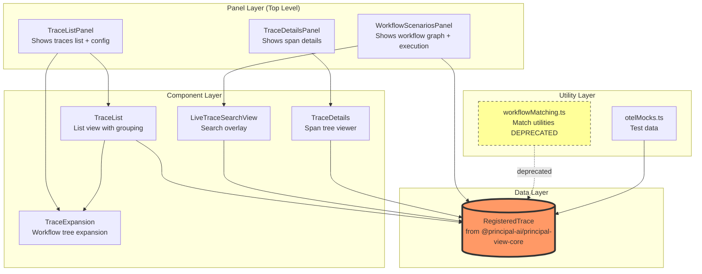
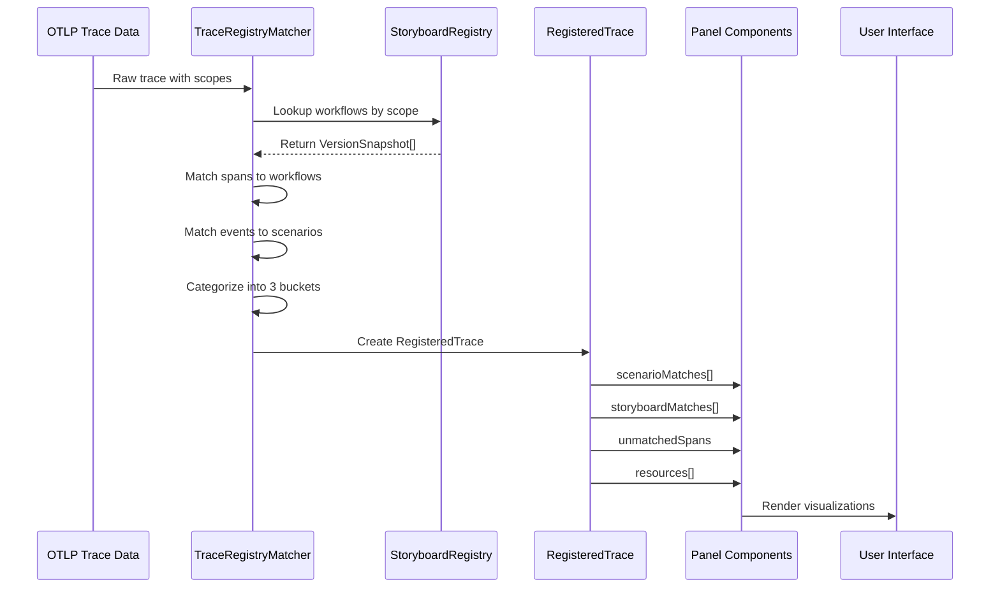

# Migration Guide: RegisteredTrace API Update

## Overview

This document explains the architecture of the trace visualization system and how to migrate from the old `RegisteredTrace` API to the new registry-based API introduced in:
- `@principal-ai/principal-view-core@0.24.10`
- `@principal-ade/panel-framework-core@0.4.2`

## Architecture Overview

### Component Hierarchy



### Data Flow



## File Relationships & Dependencies

### 1. Panel Layer (Entry Points)

#### TraceListPanel.tsx
- **Role**: Main container panel with 3 tabs (Traces, Configuration, Schematics)
- **Dependencies**:
  - Uses `TraceList` component
  - Uses `TraceExpansion` component
  - Receives `RegisteredTrace[]` from context
- **Data Flow**: `context.getSlice('telemetry')` → `traces[]` → passes to children

#### TraceDetailsPanel.tsx
- **Role**: Shows detailed span tree for a selected trace
- **Dependencies**:
  - Uses `TraceDetails` component
  - Receives `RegisteredTrace` as prop
- **Data Flow**: `selectedTrace` prop → `TraceDetails` component

#### WorkflowScenariosPanel.tsx
- **Role**: Main workflow graph visualization with execution overlay
- **Dependencies**:
  - Uses `LiveTraceSearchView` for trace search
  - Uses `GraphRenderer` for workflow visualization
  - Uses `ScenariosList` for scenario selection
- **Data Flow**:
  - `context.getSlice('telemetry')` → filters by scenario → overlays on graph
  - User selects scenario → filters traces → shows matches

---

### 2. Component Layer (UI Components)

#### TraceList.tsx
- **Role**: Renders list of traces with grouping, search, stats
- **Used By**: `TraceListPanel`
- **Dependencies**: `TraceExpansion` (for expanded view)
- **Key Functions**:
  - Groups traces by service/scope
  - Calculates matching statistics
  - Provides search/filter UI
- **Data Usage**:
  - `trace.serviceName` - for grouping
  - `trace.scope` - for grouping key
  - `trace.registryStatus` - for stats
  - `trace.matchInfo` - for match details
  - `trace.matchedNodesSummary` - for quick stats

#### TraceExpansion.tsx
- **Role**: Expandable tree showing workflow/scenario matches
- **Used By**: `TraceList`
- **Dependencies**: `WorkflowScenarioTreeCore` from dynamic-file-tree
- **Key Functions**:
  - Converts `RegisteredTrace` to tree structure
  - Shows matched scenarios with coverage
  - Shows unmatched events
- **Data Usage**:
  - `trace.registryStatus` - to check if matched
  - `trace.matchInfo` - for storyboard/scenario IDs
  - `trace.spanMatches` - for matched spans

#### LiveTraceSearchView.tsx
- **Role**: Search/filter overlay for live trace selection
- **Used By**: `WorkflowScenariosPanel`
- **Key Functions**:
  - Filters traces by scenario ID
  - Text search across attributes
  - Shows match indicators
- **Data Usage**:
  - `trace.registryStatus` - to filter matched traces
  - `trace.matchInfo.scenarioId` - to filter by scenario
  - `trace.serviceName` - for display
  - `trace.scope` - for display

---

### 3. Utility Layer

#### workflowMatching.ts
- **Status**: DEPRECATED (marked in file)
- **Role**: Client-side trace matching utilities
- **Note**: Matching logic is moving to registry/backend
- **Data Usage**:
  - `trace.matchedNodesSummary` - for summary stats

#### otelMocks.ts
- **Role**: Test data and Storybook fixtures
- **Creates**: Mock `RegisteredTrace` objects
- **Usage**: Development, testing, visual regression

---

## API Changes: Old vs New

### Old API Structure

```typescript
interface RegisteredTrace {
  traceId: string;
  name: string;
  serviceName: string;        // ❌ REMOVED - now in resources[]
  scope: {                     // ❌ REMOVED - now in resources[].scopes[]
    name: string;
    version?: string;
  };
  registryStatus: 'matched' | 'unmatched' | 'error';  // ❌ REMOVED
  matchInfo?: {                // ❌ REMOVED - replaced by scenarioMatches[]
    storyboardId: string;
    scenarioId: string;
    schemaVersion?: string;
    // ... other fields
  };
  spanMatches?: MatchedSpan[]; // ❌ REMOVED - now in scenarioMatches[].matchedSpans
  matchedNodesSummary?: {      // ❌ REMOVED - calculate from scenarioMatches
    totalNodes: number;
    matchedNodes: number;
  };
  // ... other fields
}
```

### New API Structure

```typescript
interface RegisteredTrace {
  traceId: string;
  name: string;
  startTime: number;
  endTime: number;
  duration: number;
  spanCount: number;
  hasErrors: boolean;

  // NEW: Multi-resource, multi-scope structure
  resources: TraceResource[];  // ✅ NEW - contains service info

  // NEW: Three-category matching system
  scenarioMatches: ScenarioMatch[];      // ✅ Category 1: Full matches
  storyboardMatches: StoryboardMatch[];  // ✅ Category 2: Workflow matched, no scenario
  unmatchedSpans: UnmatchedSpans;        // ✅ Category 3: No workflow match

  validationIssues?: ValidationIssue[];  // ✅ NEW - match quality info
  otlpData?: OtelExportTraceServiceRequest; // Original OTLP data
}

// NEW: Resource structure
interface TraceResource {
  serviceIdentifier: string;  // e.g., "http://localhost:3000"
  serviceName: string;         // e.g., "web-ade"
  attributes?: Record<string, unknown>;
  scopes: Array<{
    scope: {
      name: string;     // e.g., "pkg:npm/@acme/auth-library"
      version: string;  // e.g., "1.0.0"
      attributes?: Record<string, unknown>;
    };
    spanIds: string[];  // Spans belonging to this scope
  }>;
}

// NEW: Scenario match (Category 1)
interface ScenarioMatch {
  storyboardId: string;
  scenarioId: string;
  scopeName: string;
  matchedSpans: MatchedSpan[];
  coveragePercent?: number;
  matchType?: 'full' | 'partial';
}

// NEW: Storyboard match (Category 2)
interface StoryboardMatch {
  storyboardId: string;
  scopeName: string;
  orphanedSpans: OrphanedSpan[];  // Spans that matched workflow but no scenario
}

// NEW: Unmatched spans (Category 3)
interface UnmatchedSpans {
  spans: UnmatchedSpan[];  // Spans that didn't match any workflow
}
```

## Migration Strategy by File

### Helper Functions Needed

Create these helper utilities first:

```typescript
// src/utils/traceHelpers.ts

/**
 * Get primary service name from trace
 * Uses first resource's serviceName
 */
export function getServiceName(trace: RegisteredTrace): string {
  return trace.resources[0]?.serviceName || 'unknown';
}

/**
 * Get primary scope from trace
 * Uses first resource's first scope
 */
export function getPrimaryScope(trace: RegisteredTrace): { name: string; version: string } | null {
  const firstScope = trace.resources[0]?.scopes[0];
  if (!firstScope) return null;
  return {
    name: firstScope.scope.name,
    version: firstScope.scope.version || 'unknown'
  };
}

/**
 * Check if trace has any matches
 * Replaces registryStatus === 'matched'
 */
export function isTraceMatched(trace: RegisteredTrace): boolean {
  return trace.scenarioMatches.length > 0 || trace.storyboardMatches.length > 0;
}

/**
 * Get all scenario IDs that matched this trace
 */
export function getMatchedScenarioIds(trace: RegisteredTrace): string[] {
  return trace.scenarioMatches.map(m => m.scenarioId);
}

/**
 * Get primary storyboard ID
 * Returns first matched storyboard
 */
export function getPrimaryStoryboardId(trace: RegisteredTrace): string | null {
  if (trace.scenarioMatches.length > 0) {
    return trace.scenarioMatches[0].storyboardId;
  }
  if (trace.storyboardMatches.length > 0) {
    return trace.storyboardMatches[0].storyboardId;
  }
  return null;
}

/**
 * Calculate matched nodes summary
 * Replaces trace.matchedNodesSummary
 */
export function getMatchedNodesSummary(trace: RegisteredTrace): {
  totalNodes: number;
  matchedNodes: number;
} {
  // Count unique node IDs across all scenario matches
  const matchedNodeIds = new Set<string>();

  trace.scenarioMatches.forEach(match => {
    match.matchedSpans.forEach(span => {
      matchedNodeIds.add(span.nodeId);
    });
  });

  return {
    matchedNodes: matchedNodeIds.size,
    totalNodes: matchedNodeIds.size, // TODO: Get from canvas definition if available
  };
}

/**
 * Filter traces by scenario ID
 * Replaces trace.matchInfo?.scenarioId === scenarioId
 */
export function filterTracesByScenario(
  traces: RegisteredTrace[],
  scenarioId: string
): RegisteredTrace[] {
  return traces.filter(trace =>
    trace.scenarioMatches.some(match => match.scenarioId === scenarioId)
  );
}

/**
 * Get match quality indicator
 * Replaces registryStatus
 */
export function getMatchQuality(trace: RegisteredTrace): 'matched' | 'partial' | 'unmatched' {
  if (trace.scenarioMatches.length > 0) {
    return 'matched';
  }
  if (trace.storyboardMatches.length > 0) {
    return 'partial';
  }
  return 'unmatched';
}
```

---

### File-by-File Migration Plan

#### 1. TraceExpansion.tsx (19 errors)

**Old Code Pattern:**
```typescript
if (trace.registryStatus !== 'matched' || !trace.matchInfo) {
  return [];
}
const { matchInfo } = trace;
const storyboardId = matchInfo.storyboardId;
const scenarioId = matchInfo.scenarioId;
```

**New Code Pattern:**
```typescript
if (trace.scenarioMatches.length === 0) {
  return [];
}

// Get primary match (first scenario match)
const primaryMatch = trace.scenarioMatches[0];
const storyboardId = primaryMatch.storyboardId;
const scenarioId = primaryMatch.scenarioId;
const matchedSpans = primaryMatch.matchedSpans;
```

---

#### 2. TraceList.tsx (37 errors)

**Old Code Pattern:**
```typescript
const withVersion = traces.filter(t => t.scope.version || t.matchInfo?.schemaVersion);
const matched = traces.filter(t => t.registryStatus === 'matched');

const groupKey = `${trace.serviceName}-${trace.scope.name}`;
```

**New Code Pattern:**
```typescript
import { getPrimaryScope, isTraceMatched, getServiceName } from '../utils/traceHelpers';

const withVersion = traces.filter(t => {
  const scope = getPrimaryScope(t);
  return scope?.version;
});
const matched = traces.filter(t => isTraceMatched(t));

const serviceName = getServiceName(trace);
const scope = getPrimaryScope(trace);
const groupKey = `${serviceName}-${scope?.name || 'unknown'}`;
```

---

#### 3. LiveTraceSearchView.tsx (14 errors)

**Old Code Pattern:**
```typescript
return traces.filter(trace =>
  trace.registryStatus === 'matched' &&
  trace.matchInfo?.scenarioId === selectedScenarioId
);

// Display
{trace.serviceName}
{trace.scope.name}
```

**New Code Pattern:**
```typescript
import { filterTracesByScenario, getServiceName, getPrimaryScope } from '../../utils/traceHelpers';

return filterTracesByScenario(traces, selectedScenarioId);

// Display
const serviceName = getServiceName(trace);
const scope = getPrimaryScope(trace);
{serviceName}
{scope?.name}
```

---

#### 4. TraceDetailsPanel.tsx (5 errors)

**Old Code Pattern:**
```typescript
const serviceName = trace.serviceName || 'Unknown';
const isMatched = trace.registryStatus === 'matched';
const scenario = trace.matchInfo?.scenarioId;
```

**New Code Pattern:**
```typescript
import { getServiceName, getMatchQuality, getMatchedScenarioIds } from '../utils/traceHelpers';

const serviceName = getServiceName(trace);
const matchQuality = getMatchQuality(trace);
const scenarioIds = getMatchedScenarioIds(trace);
```

---

#### 5. TraceListPanel.tsx (4 errors)

**Changes**: Minimal - mostly passes through to TraceList component
- Import helper functions for any local filtering logic
- Pass through to updated TraceList component

---

#### 6. WorkflowScenariosPanel.tsx (4 errors)

**Old Code Pattern:**
```typescript
const filteredTraces = traces.filter(
  t => t.registryStatus === 'matched' &&
       t.matchInfo?.scenarioId === selectedScenarioId
);

{trace.serviceName}
```

**New Code Pattern:**
```typescript
import { filterTracesByScenario, getServiceName } from '../utils/traceHelpers';

const filteredTraces = filterTracesByScenario(traces, selectedScenarioId);

{getServiceName(trace)}
```

---

#### 7. workflowMatching.ts (1 error)

**Status**: This file is marked as DEPRECATED
**Options**:
1. Remove the file entirely if not used
2. Update to use `getMatchedNodesSummary()` helper
3. Keep deprecated but fix type errors

---

#### 8. otelMocks.ts (2 errors)

**Old Mock Structure:**
```typescript
const mockTrace: RegisteredTrace = {
  traceId: '123',
  serviceName: 'my-service',
  scope: { name: 'test-scope', version: '1.0.0' },
  registryStatus: 'matched',
  matchInfo: {
    storyboardId: 'story-1',
    scenarioId: 'scenario-1',
  },
  // ...
};
```

**New Mock Structure:**
```typescript
const mockTrace: RegisteredTrace = {
  traceId: '123',
  name: 'Test Trace',
  startTime: Date.now(),
  endTime: Date.now() + 1000,
  duration: 1000,
  spanCount: 5,
  hasErrors: false,

  resources: [{
    serviceIdentifier: 'http://localhost:3000',
    serviceName: 'my-service',
    scopes: [{
      scope: {
        name: 'test-scope',
        version: '1.0.0',
      },
      spanIds: ['span-1', 'span-2'],
    }],
  }],

  scenarioMatches: [{
    storyboardId: 'story-1',
    scenarioId: 'scenario-1',
    scopeName: 'test-scope',
    matchedSpans: [
      {
        spanId: 'span-1',
        spanName: 'test-span',
        nodeId: 'node-1',
        timestamp: Date.now(),
        duration: 100,
        events: ['event-1'],
      }
    ],
    coveragePercent: 100,
    matchType: 'full',
  }],

  storyboardMatches: [],
  unmatchedSpans: { spans: [] },
};
```

---

## Migration Steps

### Phase 1: Create Helpers
1. Create `src/utils/traceHelpers.ts` with helper functions
2. Add unit tests for helpers

### Phase 2: Update Utilities
3. Update `otelMocks.ts` with new structure
4. Update or remove `workflowMatching.ts`

### Phase 3: Update Components (Bottom-Up)
5. Update `TraceExpansion.tsx`
6. Update `TraceList.tsx`
7. Update `LiveTraceSearchView.tsx`

### Phase 4: Update Panels (Top-Down)
8. Update `TraceDetailsPanel.tsx`
9. Update `TraceListPanel.tsx`
10. Update `WorkflowScenariosPanel.tsx`

### Phase 5: Verification
11. Run typecheck
12. Run build
13. Test in Storybook
14. Manual testing

---

## Testing Checklist

After migration, verify:

- [ ] Traces display in TraceList with correct service names
- [ ] Grouping by service/scope works correctly
- [ ] Match statistics calculate correctly (matched vs unmatched)
- [ ] TraceExpansion shows workflow tree correctly
- [ ] Scenario filtering works in LiveTraceSearchView
- [ ] Search functionality still works
- [ ] TraceDetails panel shows correct information
- [ ] WorkflowScenariosPanel overlays execution data correctly
- [ ] Mocks work in Storybook
- [ ] No TypeScript errors
- [ ] Build completes successfully

---

## Questions for Product/Architecture Team

Before starting migration, clarify:

1. **Multi-resource traces**: Can a trace have multiple resources? If so, how should we display them in the UI?
2. **Multi-scenario matches**: Can a trace match multiple scenarios? How should we prioritize which to show?
3. **Partial matches**: How should we display `storyboardMatches` (workflow matched but no scenario)?
4. **Unmatched spans**: Should we show `unmatchedSpans` in the UI? Where?
5. **Validation issues**: Should we display `validationIssues` to users? How?
6. **Deprecated utilities**: Should `workflowMatching.ts` be removed or updated?

---

## Reference Links

- [New API Type Definitions](./node_modules/@principal-ai/principal-view-core/dist/types/registered-trace.d.ts)
- Design Doc: `docs/LIBRARY_TELEMETRY_AND_MATCHING.md` (mentioned in type comments)

---

## Summary

This migration updates from a **flat, single-match model** to a **hierarchical, multi-match model**:

- **Before**: One service, one scope, one match result (matched/unmatched)
- **After**: Multiple resources, multiple scopes, three match categories (scenarios/storyboards/unmatched)

The new API provides richer information about trace matching quality and supports multi-library, multi-service tracing scenarios.
