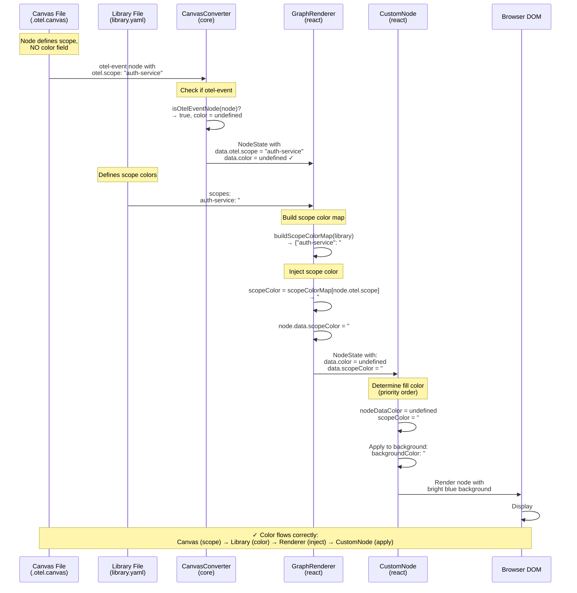
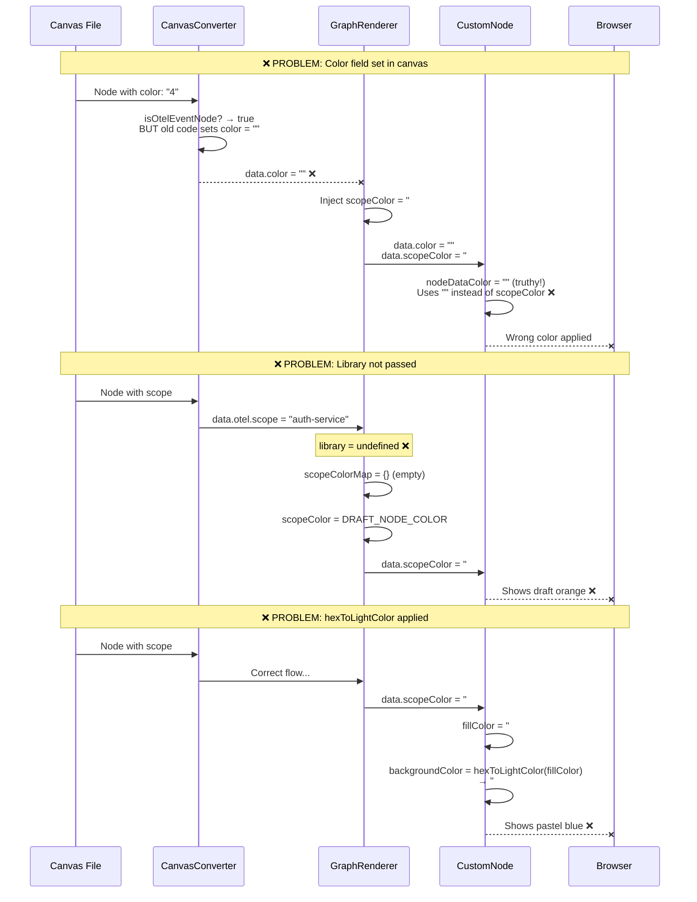

# Color Flow in OTEL Event Nodes - Debugging Guide

## Overview

This document explains how colors flow from canvas files through the rendering pipeline to eventually display on event nodes. Understanding this flow is critical for debugging color issues.

## Sequence Diagram



## What Can Go Wrong?



## The Color Flow Pipeline

### 1. Canvas File Definition (.otel.canvas)

Event nodes are defined with an `otel.scope` field but **no color field**:

```json
{
  "nodes": [
    {
      "id": "user-login",
      "type": "otel-event",
      "label": "User Login",
      "event": {
        "name": "auth.user.login"
      },
      "otel": {
        "scope": "auth-service",
        "status": "implemented"
      }
      // NOTE: No "color" or "fill" field here!
    }
  ]
}
```

### 2. Library Definition (library.yaml)

Scopes are defined with their colors in the library:

```yaml
scopes:
  auth-service:
    color: "#3B82F6"
    description: "Authentication service scope"
  session-service:
    color: "#10B981"
    description: "Session management service scope"
```

### 3. Canvas Conversion (CanvasConverter.ts)

**Location**: `@principal-ai/principal-view-core/src/utils/CanvasConverter.ts`

The `convertOtelNodeToGraph` method converts canvas nodes to `NodeState`:

```typescript
private static convertOtelNodeToGraph(node: OtelNode, now: number): NodeState {
  // For otel-event nodes: skip explicit colors (use scope-based coloring)
  // For other OTEL nodes: allow explicit fill/color
  const color = isOtelEventNode(node)
    ? undefined
    : (node.fill || resolveCanvasColor(node.color) || undefined);

  const nodeData: Record<string, JsonValue> = {
    description: ('description' in node && node.description) || '',
    shape: node.shape || 'rectangle',
    width: node.width,
    height: node.height,
    sources: [],
    references: [],
    canvasType: node.type,
    nodeType: node.type,
  };

  // Only add color if it's defined (skip for otel-event nodes)
  if (color !== undefined) {
    nodeData.color = color;
  }

  // Add OTEL data
  if ('otel' in node && node.otel) {
    nodeData.otel = node.otel as JsonValue;
  }

  return {
    id: node.id,
    type: 'custom',
    data: nodeData,
    // ...
  };
}
```

**Key Point**: For `otel-event` nodes, `nodeData.color` is **not set at all**. This is critical because if it were set (even to an empty string), it would override scope colors later.

### 4. Scope Color Injection (GraphRenderer.tsx)

**Location**: `@principal-ai/principal-view-react/src/components/GraphRenderer.tsx`

The `useCanvasToLegacy` hook injects scope colors into node data:

```typescript
// Build scope color map from library scopes
const scopeColorMap = buildScopeColorMap(library);

// Inject scope and span colors into nodes
for (const node of nodes) {
  const otel = node.data?.otel as { scope?: string } | undefined;
  const scope = otel?.scope;

  // Determine scope color (for fill/background)
  let nodeScopeColor: string;
  if (scope && scopeColorMap[scope]) {
    // Node has a scope with a defined color - use it as fill color
    nodeScopeColor = scopeColorMap[scope];
  } else {
    // Draft nodes or nodes without scope get the draft color
    nodeScopeColor = DRAFT_NODE_COLOR;
  }

  // Inject both scope and span colors
  node.data = {
    ...node.data,
    scopeColor: nodeScopeColor,  // ← Injected here!
    spanColor: workflowSpanPattern ? spanColor : DEFAULT_SPAN_COLOR,
  };
}
```

**Key Point**: The `scopeColor` is looked up from the library's scopes and injected into `node.data.scopeColor`.

Helper function:
```typescript
function buildScopeColorMap(library?: ComponentLibrary): Record<string, string> {
  const map: Record<string, string> = {};
  if (!library?.scopes) return map;

  for (const [scopeName, scopeDef] of Object.entries(library.scopes)) {
    if (scopeDef.color) {
      map[scopeName] = scopeDef.color;
    }
  }
  return map;
}
```

### 5. Node Rendering (CustomNode.tsx)

**Location**: `@principal-ai/principal-view-react/src/nodes/CustomNode.tsx`

CustomNode determines the fill color with this priority:

```typescript
// Get colors from node data (injected by GraphRenderer)
const nodeDataColor = nodeData.color as string | undefined;
const scopeColor = nodeData.scopeColor as string | undefined;
const spanColor = nodeData.spanColor as string | undefined;

// Fill color priority: state color > node data color > scope color > type definition color > default
const baseFillColor = nodeDataColor || scopeColor || typeDefinition.color || '#888';
const fillColor = stateColor || baseFillColor;
```

**Priority Order** (highest to lowest):
1. `stateColor` (if node has a state like "draft", "approved", "implemented")
2. `nodeDataColor` (from `node.data.color` - should be undefined for otel-event nodes)
3. `scopeColor` (from library scopes - injected by GraphRenderer)
4. `typeDefinition.color` (from node type definition)
5. `'#888'` (default gray)

The color is then applied to the node background:

```typescript
const baseStyles = {
  padding: '12px 16px',
  backgroundColor: fillColor,  // ← Applied here!
  color: '#000',
  border: `2px ${borderStyle} ${strokeColor}`,
  // ...
};
```

**Key Point**: For otel-event nodes, `nodeDataColor` should be undefined, so it falls through to `scopeColor`.

## Common Issues and Debugging

### Issue 1: Colors Still Look Faded

**Symptom**: Event nodes show pastel/washed-out colors instead of vibrant scope colors.

**Possible Causes**:

1. **Old cached version of packages**
   ```bash
   # Check versions
   grep '"version"' node_modules/@principal-ai/principal-view-core/package.json
   grep '"version"' node_modules/@principal-ai/principal-view-react/package.json

   # Should be:
   # core: 0.26.32 or higher
   # react: 0.14.36 or higher
   ```

2. **Storybook cache not cleared**
   ```bash
   rm -rf node_modules/.cache/storybook
   ```

3. **`nodeData.color` is being set somewhere**
   - Check if CanvasConverter is setting `color: ''` for otel-event nodes
   - Add console.log in CustomNode to see what's in nodeData:
   ```typescript
   console.log('Node data:', nodeData);
   console.log('nodeDataColor:', nodeDataColor);
   console.log('scopeColor:', scopeColor);
   ```

4. **Library not being passed to GraphRenderer**
   ```tsx
   // Make sure you're passing the library prop!
   <GraphRenderer
     canvas={canvas}
     library={library}  // ← Required!
   />
   ```

5. **Scope not defined in library**
   - Check that the scope name in the canvas matches the library
   - Canvas: `"scope": "auth-service"`
   - Library: `scopes.auth-service.color: "#3B82F6"`

### Issue 2: All Nodes Are Gray

**Symptom**: Event nodes show default gray color (#888).

**Cause**: The color priority falls through to the default because:
1. No library is passed to GraphRenderer
2. Scope name doesn't match between canvas and library
3. Library scopes don't have colors defined

**Debug**:
```typescript
// In GraphRenderer, add logging:
console.log('Library scopes:', library?.scopes);
console.log('Scope color map:', scopeColorMap);
console.log('Node scope:', node.data.otel?.scope);
```

### Issue 3: Wrong Colors

**Symptom**: Event nodes show colors, but not the ones defined in library.yaml.

**Causes**:
1. `nodeData.color` is set (overrides scopeColor)
2. State colors are being applied (e.g., "draft" = orange)
3. Type definition colors are being used

**Debug**:
```typescript
// In CustomNode:
console.log('Color priority check:');
console.log('- stateColor:', stateColor);
console.log('- nodeDataColor:', nodeDataColor);
console.log('- scopeColor:', scopeColor);
console.log('- typeDefinition.color:', typeDefinition.color);
console.log('Final fillColor:', fillColor);
```

## Testing the Color Flow

Create a minimal test case to verify the color flow:

```typescript
// test-colors.canvas.json
{
  "nodes": [
    {
      "id": "test-event",
      "type": "otel-event",
      "x": 100,
      "y": 100,
      "width": 200,
      "height": 80,
      "label": "Test Event",
      "event": { "name": "test.event" },
      "otel": { "scope": "test-scope" }
    }
  ],
  "edges": []
}
```

```yaml
# test-library.yaml
version: "1.0.0"
name: Test Library
scopes:
  test-scope:
    color: "#FF0000"  # Bright red - should be unmistakable
    description: "Test scope"
```

```tsx
// Render
<GraphRenderer
  canvas={testCanvas}
  library={testLibrary}
/>
```

**Expected Result**: Node background should be bright red (#FF0000), not a pastel pink.

## Version History of Fixes

### v0.26.32 (core)
- **Fix**: CanvasConverter no longer sets `color` field for otel-event nodes
- **Change**: `color` is now `undefined` instead of `''` for event nodes
- **File**: `packages/core/src/utils/CanvasConverter.ts:422-434`

### v0.14.35 (react)
- **Fix**: Removed `hexToLightColor()` from CustomNode for all shapes
- **Change**: Rectangle, hexagon, and diamond backgrounds now use `fillColor` directly
- **File**: `packages/react/src/nodes/CustomNode.tsx:582,699,745`

### v0.14.33 (react)
- **Fix**: Removed `hexToLightColor()` from OtelEventNode
- **Change**: Background uses `fillColor` instead of `hexToLightColor(fillColor)`
- **File**: `packages/react/src/nodes/otel/OtelEventNode.tsx:145`

## Architecture Notes

### Why Not Use OtelEventNode Component?

You might notice there's an `OtelEventNode` component but it's not actually being used. All nodes (including otel-event) are rendered by `CustomNode`:

```typescript
// GraphRenderer.tsx line 356
const nodeTypes = { custom: CustomNode } as NodeTypes;
```

This is why changes to CustomNode were necessary even though OtelEventNode exists.

### Why Two Color Fields?

The system has two color-related fields in node data:

1. **`color`**: Explicit color from the canvas file (deprecated for otel-event nodes)
2. **`scopeColor`**: Derived color from library scopes (preferred for otel-event nodes)

This separation allows:
- Event nodes to get colors from scopes (ownership-based)
- Other nodes to still use explicit colors
- Gradual migration from explicit colors to scope-based colors

### Future: Consolidation

Ideally, the system should consolidate to a single color source. Possible approaches:
1. Always use `scopeColor` for all OTEL nodes
2. Remove `color` field entirely for OTEL nodes
3. Make `color` a computed field that resolves from scope

This would eliminate the priority confusion and make the color flow more straightforward.
